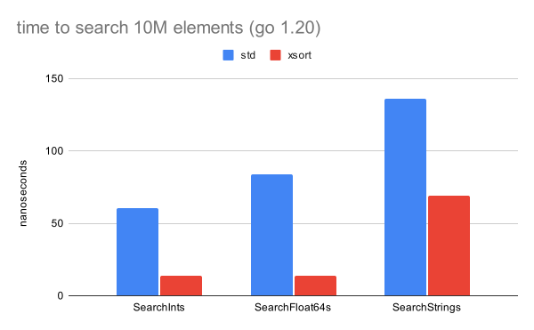

# xsort

[](https://pkg.go.dev/github.com/mroth/xsort)

Manually inlined versions of the "search wrappers" in the Go standard `sort`
library (`SearchInts`, `SearchFloat64s`, `SearchStrings`), which perform up to
80% faster. Usage is identical.

## Why?

In the standard library, these are convenience wrappers around the generic
`sort.Search()` function, which takes a function parameter to determine
truthfulness. However, since this function is utilized within a for loop,
[it cannot currently be inlined by the Go compiler][1], resulting in non-trivial
performance overhead.

## Performance

Some quick single threaded benchmarks on 10M element slices on my laptop:
```
$ go test -bench=. -count=10 -cpu=1 | benchstat -col="/lib@(std xsort)" -
goos: darwin
goarch: arm64
pkg: github.com/mroth/xsort
               │     std      │                xsort                │
               │    sec/op    │   sec/op     vs base                │
SearchInts        60.47n ± 0%   13.75n ± 1%  -77.25% (p=0.000 n=10)
SearchFloat64s    83.52n ± 0%   13.77n ± 0%  -83.51% (p=0.000 n=10)
SearchStrings    136.05n ± 0%   69.17n ± 0%  -49.16% (p=0.000 n=10)
geomean           88.24n        23.57n       -73.28%
```



[1]: https://github.com/golang/go/issues/15561
